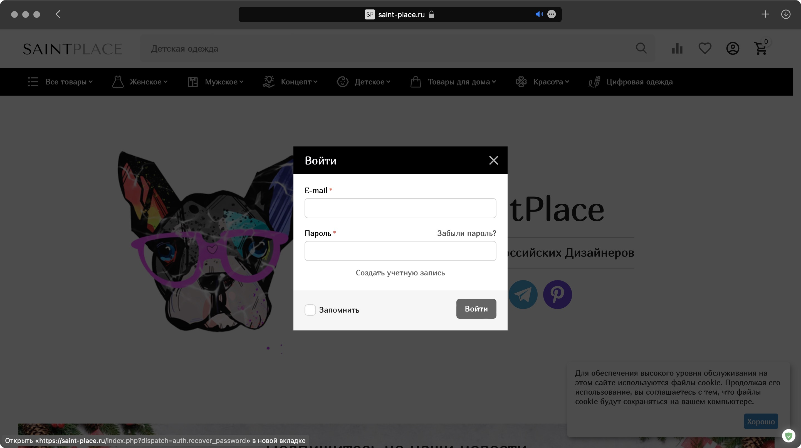
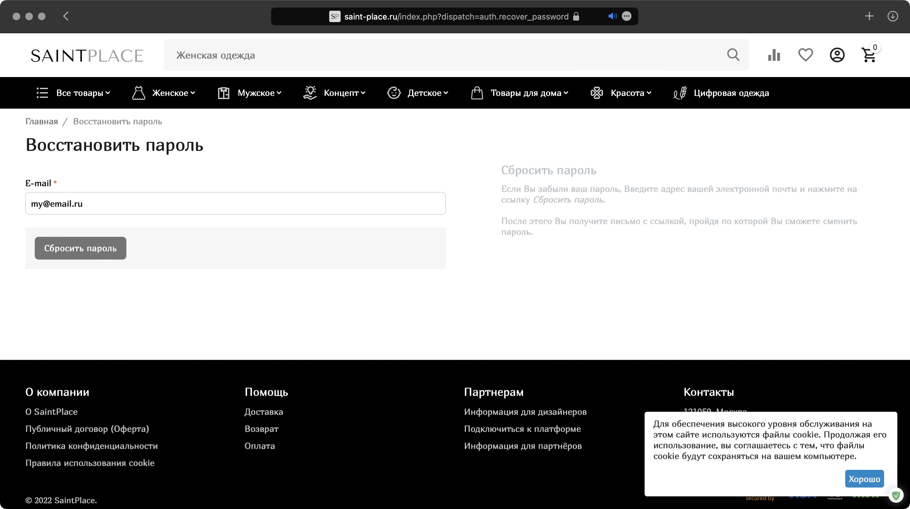

# Что делать, если забыл пароль от учётной записи?

1. Щёлкните по значку профиля на витрине, в выпавшем окне щёлкните по кнопке **"Войти"**. В открывшемся окне нажмите **"Забыли пароль?"**.

2. На следующей странице введите свой email и щёлкните **"Сбросить пароль"**. После этого на указанный адрес будет отправлено письмо с инструкциями по восстановлению пароля.

3. Щёлкните по ссылке указанной в письме и нажмите **"Продолжить"**.

4. На странице редактирования учётной записи введите новый пароль, повторите его и нажмите **"Сохранить"**.