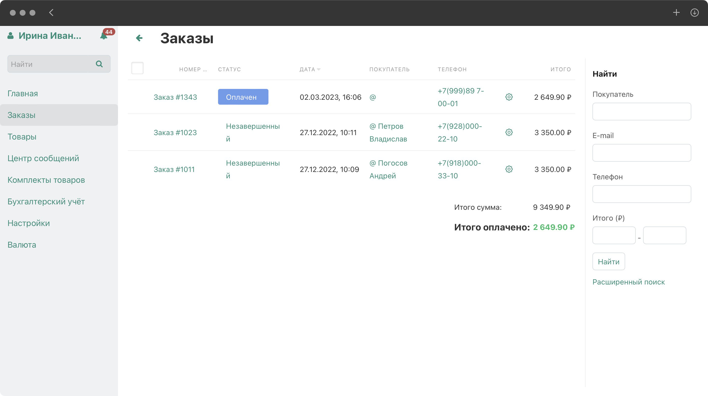
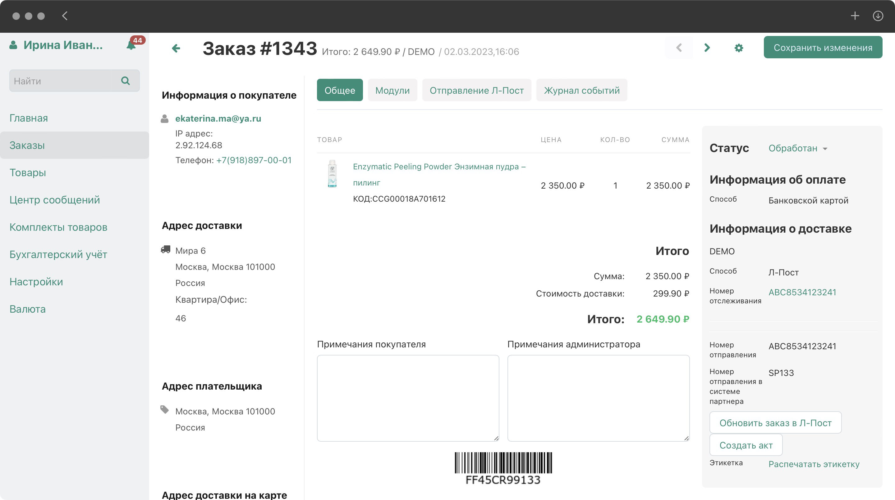

# Обработка заказов

Заказ – это намерение покупателя заключить сделку купли-продажи на тех условиях, которые предложил продавец. Каждый новый заказ, оформленный покупателем, попадает в общий список заказов продавца. Маркетплейс направляет уведомление о таком событии администраторам продавца посредством email-сообщения.

Если заказ был оплачен картой онлайн (кредитной или дебетовой картой), то заказу будет присвоен статус "Оплачен".

После нажатия кнопки **"Подтвердить"** отменить заказ будет невозможно.

## Список заказов

На странице **Заказы** выводится список всех заказов в вашем магазине, которые были сделаны покупателями. По умолчанию заказы отсортированы по дате: чем новее заказ, тем выше он расположен в списке.

Воспользуйтесь формой поиска справа, чтобы найти те заказы, которые соответствуют определённым критериям. По умолчанию доступен поиск по:

-   имени покупателя;
    
-   электронной почте покупателя;
    
-   телефону;
    
-   диапазону итогов.
    

Новые заказы также доступны на главной странице панели администратора продавца.

## Как обработать заказ

1.  Откройте страницу Заказы.
    
2.  Найдите нужный заказ и щёлкните по его номеру для редактирования.
    
3.  Откроется карточка заказа со всеми доступными данными о покупателе, выбранном товаре, условиях оплаты и доставки товара.
    

4.  Уточнив все детали заказа, администратор продавца может **"Подтвердить"** или **"Отменить"** заказ.
    
5.  Подтверждая заказ, продавец подтверждает сделку, и она переходит в активную фазу. С этого момента продавец берёт на себя обязательства передать заказ покупателю на объявленных условиях.
    
6.  Если по каким-то причинам продавец не может отправить заказ в течение трёх дней, то может согласовать с покупателем новый вариант отгрузки и отменить текущий заказ.
    
7.  Для подтверждения заказа необходимо внизу страницы нажать на кнопку **"Отправить заказ в Л-Пост"**, заказ перейдет в статус Обработан, а после этого будет создана отгрузка в службу доставки Л-Пост.
    

> Внимание! Продавец обязан подтвердить заказ в течение 3 (трёх) часов
> после его получения. В противном случае заказ автоматически
> отменяется. После подтверждения заказа вы обязуетесь отправить заказ в
> течение 3 (трёх) рабочих дней. В противном случае заказ автоматически
> отменяется. Если заказ был предварительно оплачен, авансовая сумма
> будет возвращена на банковскую карту покупателя.

  

## Платная техническая поддержка

Если вы хотите быстро открыть магазин, но столкнулись с трудностями в настройке магазина, с импортом товаров, или вам нужна квалифицированная помощь, пожалуйста, рассмотрите возможность получения платной поддержки.

Мы поможем администраторам магазинов с настройками всех разделов магазина и/или с настройками импорта товаров в каталог маркетплейса. Услуга предоставляется на возмездной основе и обеспечивает запуск магазина за 2-3 рабочих дня.